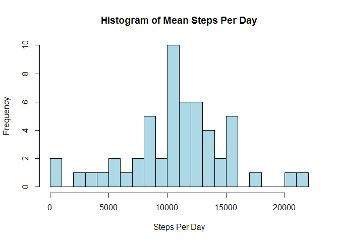
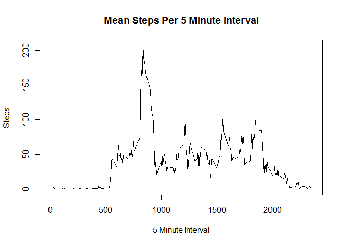
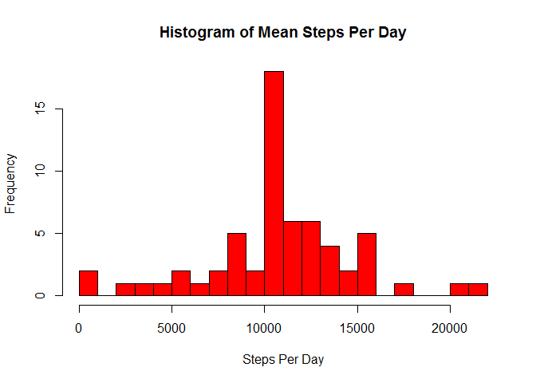
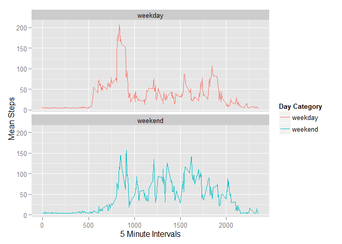

# Reproducible Research: Peer Assessment 1


## Loading and preprocessing the data

First we will unzip the data set and read it into a data frame using read.csv(). It is assumed activity.zip is already in your working directory.


```r
unzip("activity.zip")
dataSet <- read.csv("activity.csv")
```

Let's look at the first few rows of the data frame. We can see right away this data set includes three variables
(steps, date, interval) and also contains NAs.


```r
head(dataSet)
```

```
##   steps       date interval
## 1    NA 2012-10-01        0
## 2    NA 2012-10-01        5
## 3    NA 2012-10-01       10
## 4    NA 2012-10-01       15
## 5    NA 2012-10-01       20
## 6    NA 2012-10-01       25
```

## What is mean total number of steps taken per day?

To help answer this question we are going to group the data by date.
We will also ignore the NAs for this section as per the assignment.


```r
dataSetByDay <- group_by(na.omit(dataSet), date)
```

Now let's calculate the sum of steps for each day.


```r
Steps <- summarise(dataSetByDay, sumSteps = sum(steps))
```

We can show the distribution of total steps taken per day in a histogram.


```r
hist(Steps$sumSteps, xlab = "Steps Per Day", 
        main = "Histogram of Mean Steps Per Day", breaks = 20,
        col = "lightblue")
```

 

We can also calculuate and report the mean and median for steps each day.

```r
mean(Steps$sumSteps)
```

```
## [1] 10766.19
```

```r
median(Steps$sumSteps)
```

```
## [1] 10765
```

## What is the average daily activity pattern?

First lets group the data set by interval and then calculate the mean steps per interval.


```r
dataSetByInterval <- group_by(dataSet, interval)
Interval <- summarise(dataSetByInterval, meanSteps = mean(steps, na.rm = TRUE))
```

We can then show a time-series graph with the 5-min interval on the x-axis, and the mean steps on the y-axis.


```r
plot(Interval$interval, Interval$meanSteps, type = "l", 
        xlab = "5 Minute Interval", ylab = "Steps", 
        main = "Mean Steps Per 5 Minute Interval")
```

 

To determine the 5-min interval that contains the largest average number of steps we first arrange the data.


```r
Interval <- arrange(Interval, desc(meanSteps))
```

We then print the first row to determine the interval.


```r
Interval[1,]
```

```
## Source: local data frame [1 x 2]
## 
##   interval meanSteps
## 1      835  206.1698
```

We can see the 5-min interval with the largest average number of steps is 835.

## Imputing missing values

First, let's determine how many NAs are in our current data set.


```r
sum(is.na(dataSet))
```

```
## [1] 2304
```

It turns out there are 2304 NAs. Let's create an index for all NAs.


```r
indexOfNA <- which(is.na(dataSet$steps))
```

We will now devise a strategy to fill these NAs in. In this report we will use the mean of interval steps.  

As a result, we will be replacing NA data with 37.3825996


```r
newDataSet <- dataSet
newDataSet[indexOfNA, 1] <- mean(Interval$meanSteps)
```

Let's make sure all NA data has been replaced.


```r
sum(is.na(newDataSet))
```

```
## [1] 0
```

Let's re-look at the histogram with our NA data now filled in.


```r
newDataSet1 <- group_by(newDataSet, date)
newDataSet1 <- summarise(newDataSet1, sumSteps = sum(steps))
hist(newDataSet1$sumSteps, xlab = "Steps Per Day", 
     main = "Histogram of Mean Steps Per Day", breaks = 20, col = "red")
```

 

We will re-calculate and report the mean and median as well.


```r
mean(newDataSet1$sumSteps)
```

```
## [1] 10766.19
```

```r
median(newDataSet1$sumSteps)
```

```
## [1] 10766.19
```

We can conclude that the mean stays equal after filling in the NAs and the median now equals the mean!

## Are there differences in activity patterns between weekdays and weekends?

Let's first identify which dates are Weekdays and which are Weekends. We will create a new column with this information and set as factor variables.


```r
daysOfWeek <- weekdays(as.Date(newDataSet$date))
newDataSet$dayVariable <- ifelse(daysOfWeek %in% c("Saturday","Sunday"), 
        yes = "weekend", "weekday")
newDataSet$dayVariable <- as.factor(newDataSet$dayVariable)
```

Now we will group our date by interval and weekday/weekend and calculate the mean steps.


```r
dayOfWeekData <- group_by(newDataSet, interval, dayVariable)
dayOfWeekData <- summarise(dayOfWeekData, meanSteps = mean(steps))
```

We can now graph our mean steps per 5 minute interval by weekday and weekend.


```r
ggplot(dayOfWeekData, aes(interval, meanSteps, dayVariable)) + 
        geom_line(aes(color=dayVariable)) +
        facet_wrap(~ dayVariable, nrow=2) +
        xlab("5 Minute Intervals") +
        ylab("Mean Steps") +
        labs(color = "Day Category")
```

 
